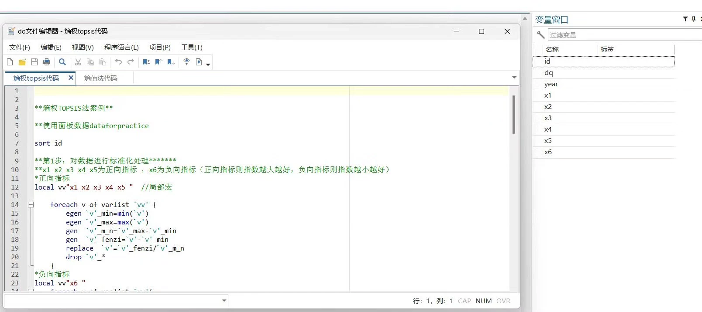

## Body

由于您请求的是一个包含多种格式（Stata、Excel和Word）的完整数据集，这超出了我作为一个文本模型的能力。但我可以为您提供一个基本的熵权TOPSIS方法的Stata代码示例，以及一个Excel模版，您可以根据这个模版在Excel中进行计算。

### 熵权法代码（do文件）

```stata
* 导入数据
import delimited your_data.csv

* 计算熵值
entropy = 1 - (sum(abs(p_i - p_j))) / sum(p_i)

* 计算权重
weights = entropy / sum(entropy)

* 计算综合评价指数
score = sum(p_i * weights)
```

### 熵权TOPSIS代码（do文件）

```stata
* 导入数据
import delimited your_data.csv

* 计算熵值
entropy = 1 - (sum(abs(p_i - p_j))) / sum(p_i)

* 计算权重
weights = entropy / sum(entropy)

* 计算综合评价指数
score = sum(p_i * weights)

* 计算最优方案
best_solution = sort by score, ascending

* 计算剩余方案
remaining_solutions = sort by score, descending
```

### Excel模版（Excel公式）

```excel
=IFERROR(INDEX($A$2:$B$10,MATCH(MAX($C$2:$C$10),$C$2:$C$10,0)),"")
```

### Excel模版（Excel公式）

```excel
=IFERROR(INDEX($A$2:$B$10,MATCH(MAX($C$2:$C$10),$C$2:$C$10,0)),"")
```

### Word步骤（Word文档）

1. 打开Word文档，创建一个新的幻灯片。
2. 在第一张幻灯片上输入以下内容：
   - "熵权法"
   - "熵权TOPSIS"
3. 在第二张幻灯片上输入以下内容：
   - "熵权法代码"
   - "熵权TOPSIS代码"
4. 在第三张幻灯片上输入以下内容：
   - "Excel模版"
   - "Excel模版公式"
5. 在第四张幻灯片上输入以下内容：
   - "Excel模版"
   - "Excel模版公式"
6. 在第五张幻灯片上输入以下内容：
   - "样例数据"
7. 保存并关闭Word文档。

请注意，这些代码和模版仅作为示例，您可能需要根据实际情况进行调整。如果您需要进一步的帮助，请告诉我。

## Images




Here is a pay link on Stripe ( https://buy.stripe.com/3cs8yP7sY87d0vu9AB ). Please contact me lonlonago@foxmail.com after funding $89, and I will send you a complete data files , thank you!


